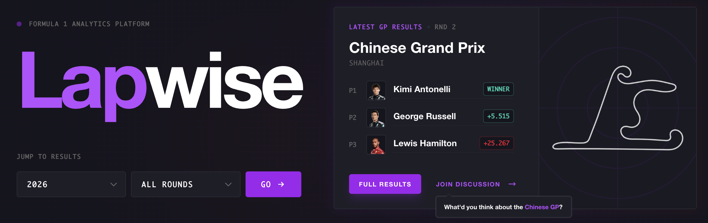
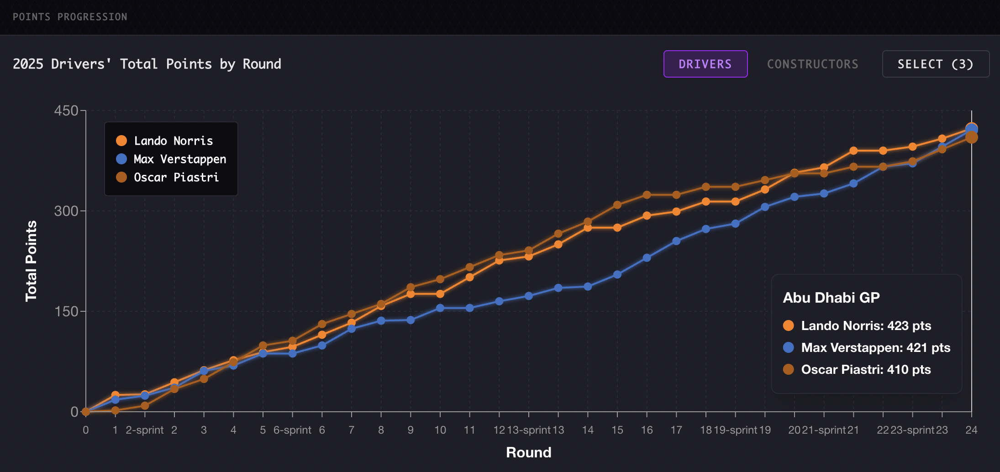
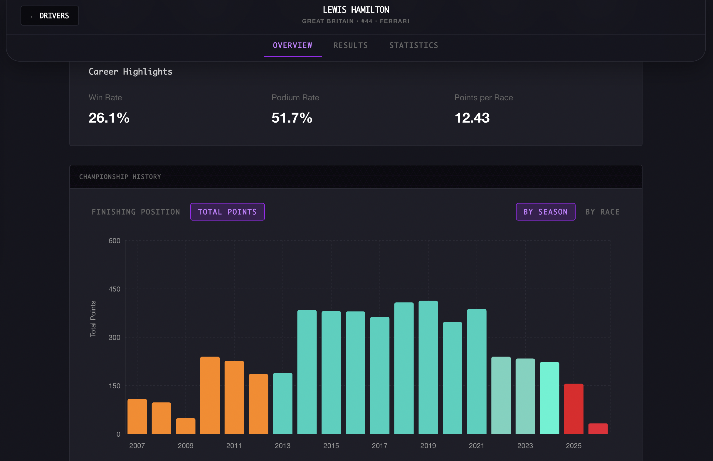
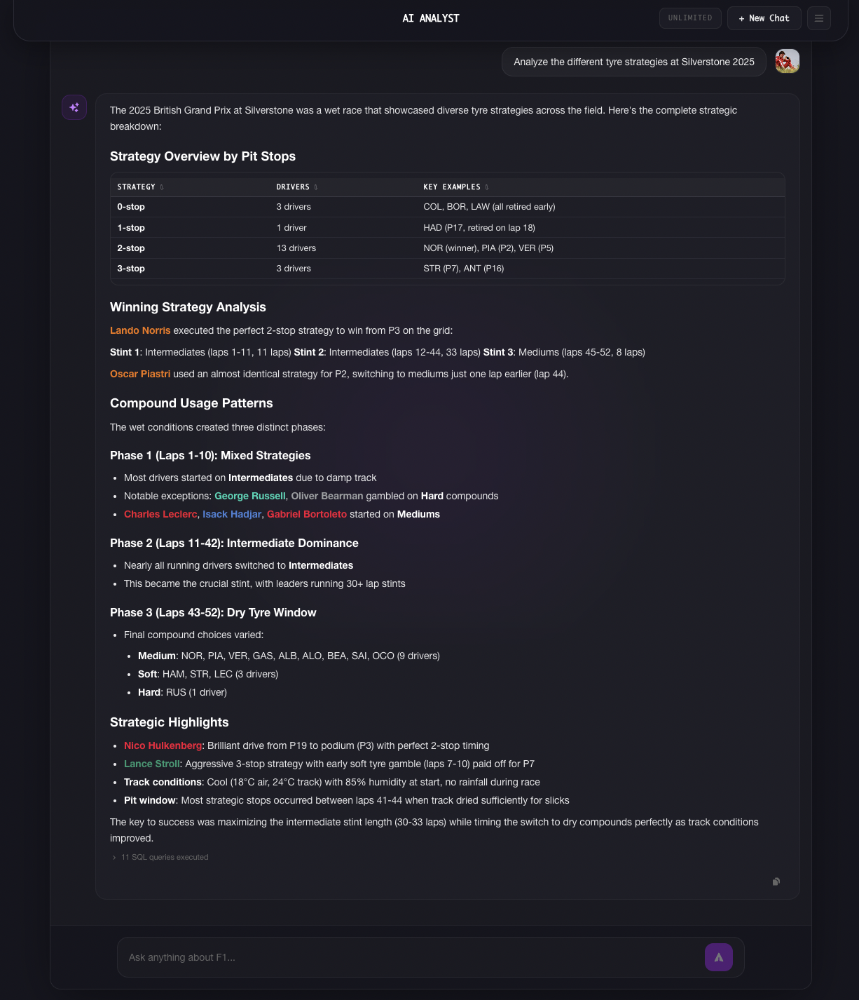
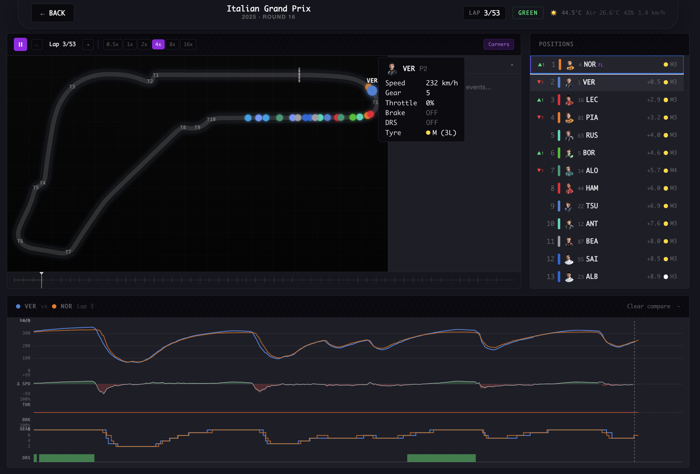

# [**lapwise.dev**](https://lapwise.dev)

### Formula 1 analytics and community for every race since 1950.

  

Lapwise is a full-stack Formula 1 analytics platform that lets fans explore 76 years of race history, dive into driver and constructor career stats, and view real telemetry data from Grand Prix weekends. It pulls from official F1 timing data and the [FastF1](https://github.com/theOehrly/Fast-F1) Python package to surface information that would otherwise require digging through spreadsheets or fragmented wikis.

---

## Features

**Race Results and Standings** -- Browse every season from 1950 to present. Full qualifying, race, and sprint results with driver standings and constructor championships.

  

**Driver and Constructor Profiles** -- Career statistics, season-by-season points progression, and complete race history for every driver and team in F1 history.

  

**Telemetry Visualizations** -- Lap time distributions, race pace analysis, and position change charts built from real session data via FastF1.

**Circuit Database** -- Track information, statistics, and historical results for every circuit on the calendar.

**Community Discussions** -- Threaded forum with voting, tagging, and markdown support for race weekend conversations.

**AI Analyst** -- Ask questions about Formula 1 and get AI-powered answers with strategy breakdowns, data tables, and interactive charts.

  

**Race Replay** -- Watch full race replays with animated driver positions on track maps, real-time telemetry comparisons, and a live leaderboard.

  

---

## Feedback

Lapwise is actively being developed and I'm always open to suggestions, feature ideas, and feedback. Feel free to [open an issue](https://github.com/colehenry/lapwise.dev/issues) or reach out directly.

---

## Support

If you enjoy the project and want to support development:

